[⬅️ Volver al README principal](./README.md)

# Galería de Capturas - DroneGestory

En esta sección se detalla visualmente el funcionamiento de la plataforma, desde el panel de control hasta la gestión de documentación técnica.

---

## Vista principal
| Primera vista | Log In |
| :---: | :---: |
| 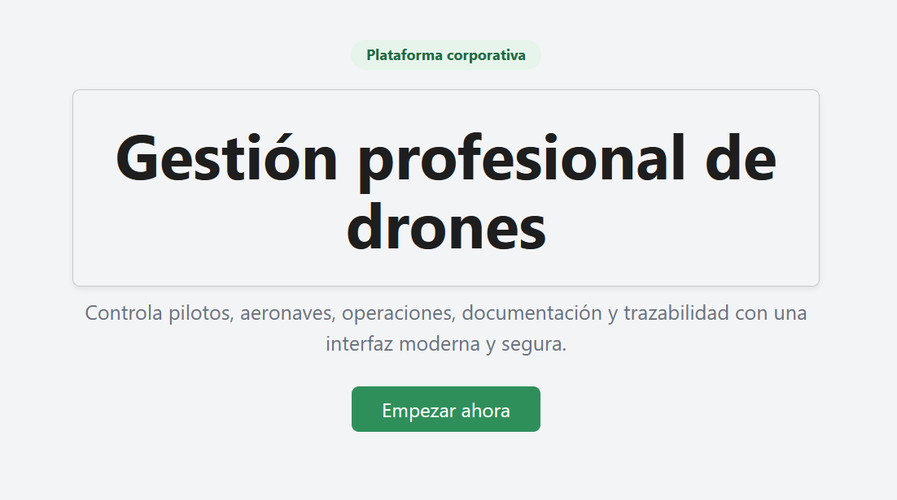 | 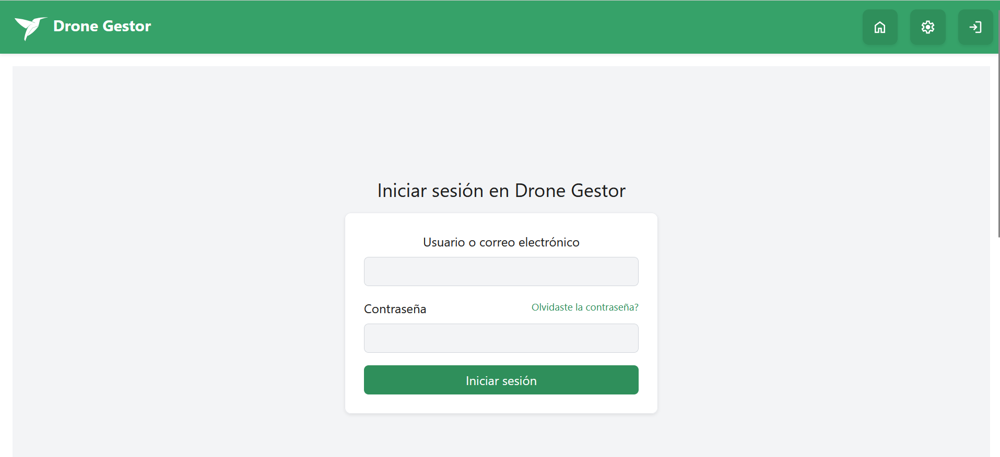 |
| *Simple introducción a la plataforma* | *Vista de inicio de sesión* |

---

## Dashboard
Estas capturas muestran el estado global de la flota y el acceso rápido a los módulos.

| Vista General | Calendario |
| :---: | :---: |
| 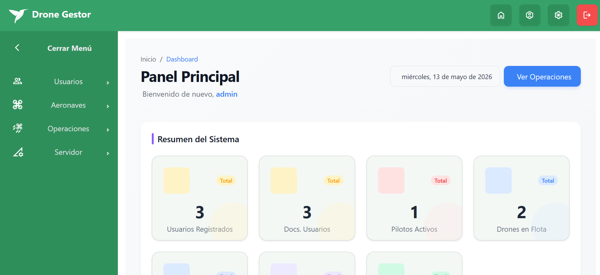 | 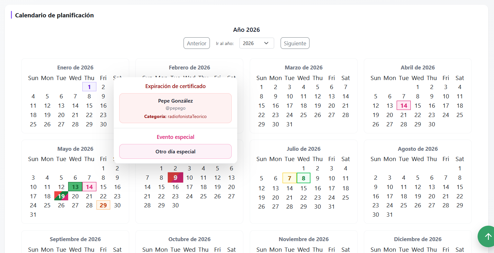 |
| *Panel principal con métricas en tiempo real* | *Visualización de caducidad de certificados, día de mantenimiento, día de operación de vuelo, etc* |

<b>Ver más capturas de dashboard</b>

| Vista día en detalle |
| :---: |
| 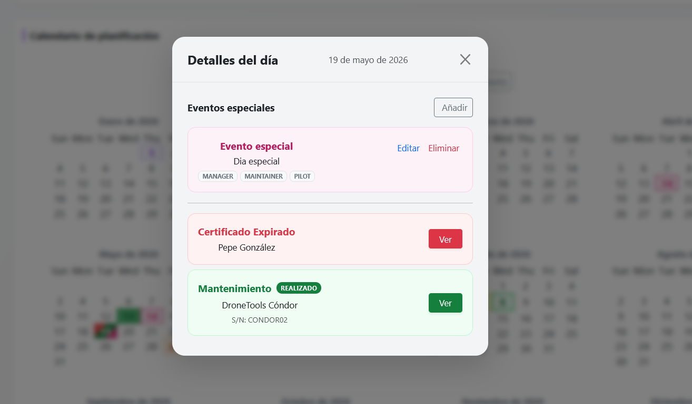 |

---

## Gestión de Usuarios
Registro, edición y visualización de usuarios y sus roles.

| Usuarios | Perfil usuario |
| :---: | :---: |
| 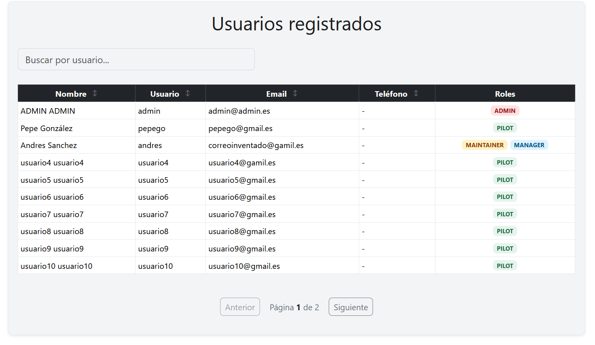 | 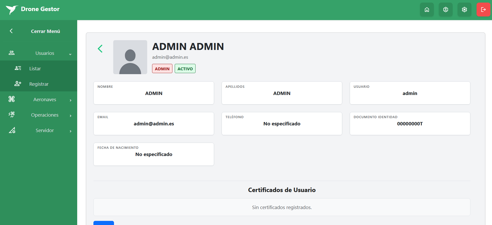 |
| *Listado de usuarios* | *Perfil de usuario en detalle* |

<b>Ver más capturas de Usuarios</b>

| Registro usuario (admin) |
| :---: |
| 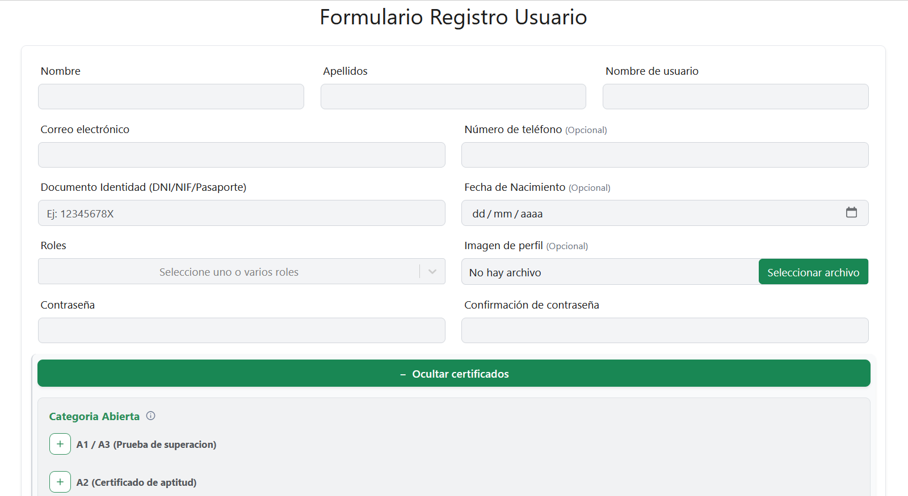 |
| *Formulario de registro de usuarios* |

---

## Gestión de Aeronaves
Registro, edición y visualización de drones individuales y modelos de fabricante.

| Registro de Nuevo Drone | Registro de nuevo Modelo |
| :---: | :---: |
| 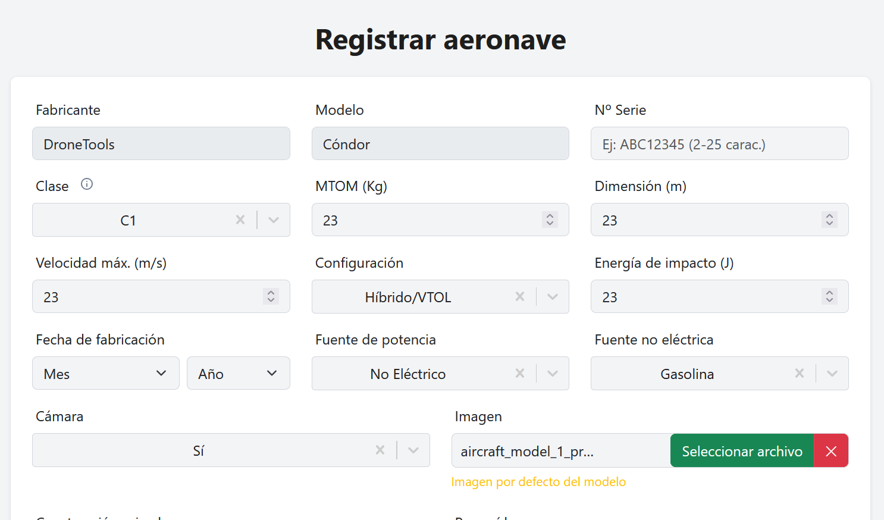 | 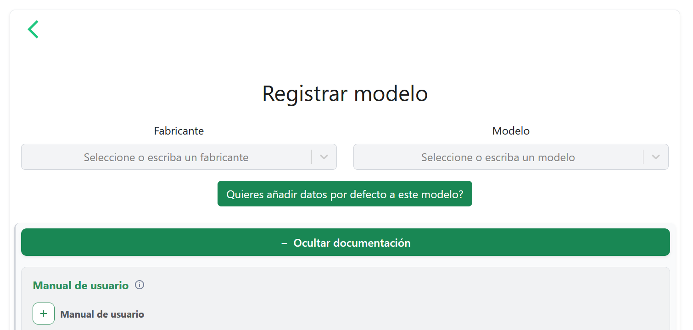 |

<b>Ver más capturas de Aeronaves</b>

| Vista registrar aeronave / modelo | Añadir documentación |
| :---: | :---: |
| 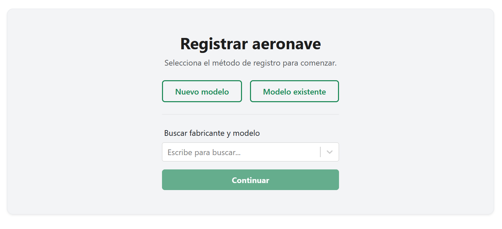 | 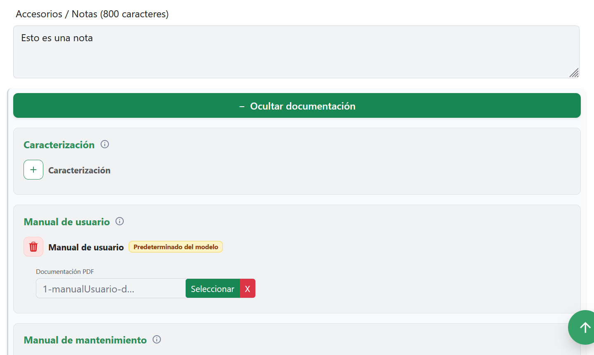|

---

## Mantenimiento y Logs
Control de ciclos de vida, reparaciones y libros de vuelo.

| Registro de Mantenimiento | Historial de Vuelos |
| :---: | :---: |
| 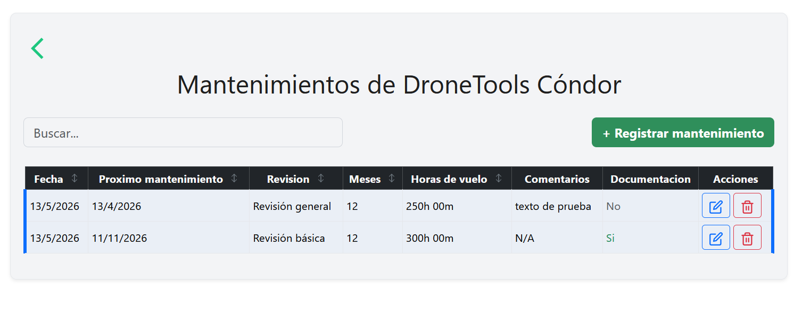 | 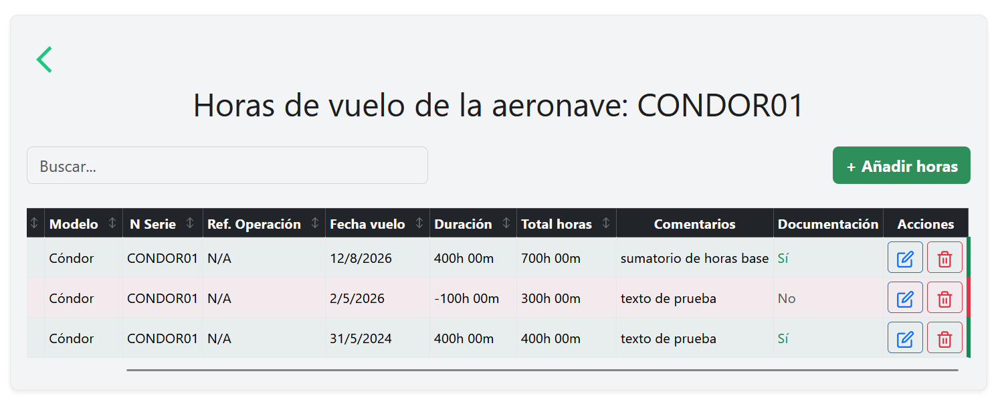 |
| *Registro y vista de mantenimientos* | *Registro de horas de vuelo controladas* |

---

## Operaciones de vuelo
Registro, versionado y firmado de Operaciones acorde con los requisitos de AESA (2026)

| Operación | Anexo6 |
| :---: | :---: |
| 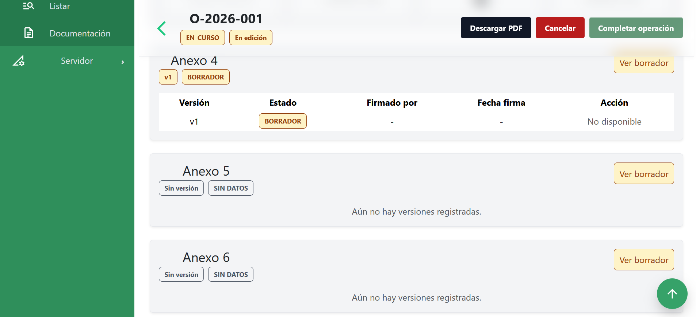 | 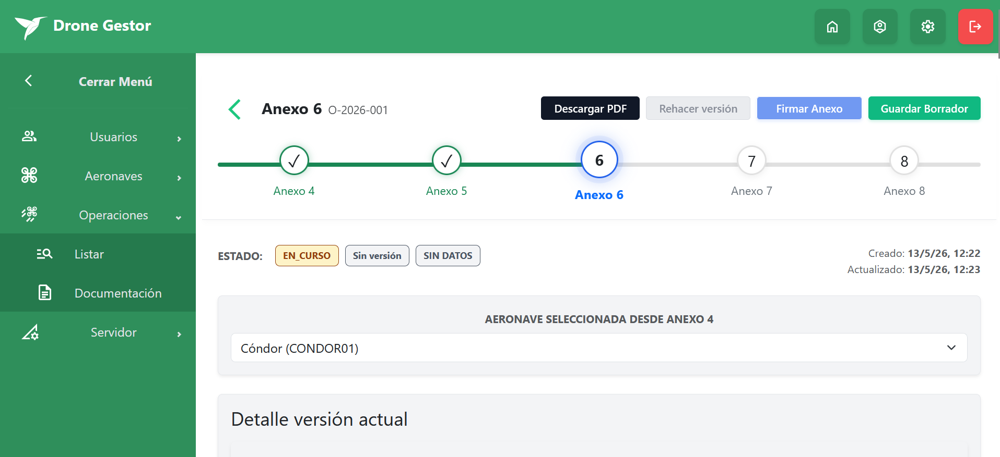 |
| *Vista registro operación haciendo scroll para abajo* | *Vista breve de anexo 6* |

<b>Ver más capturas de operaciones</b>

| Vista documentación de operación |
| :---: |
| 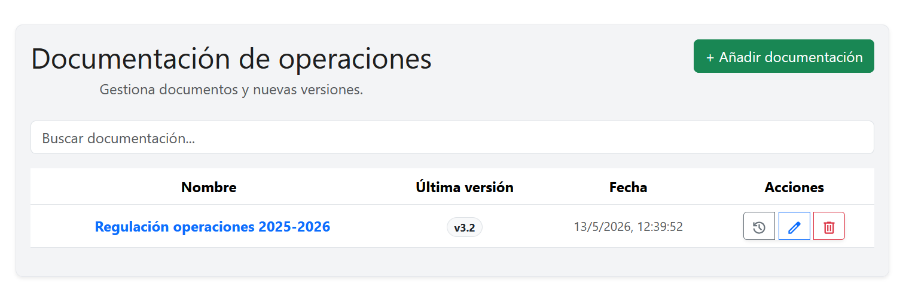 |

---

## Vista servidor
Vista opciones de administrador en el servidor

| Envió de correo y mensajería | File Manager |
| :---: | :---: |
| 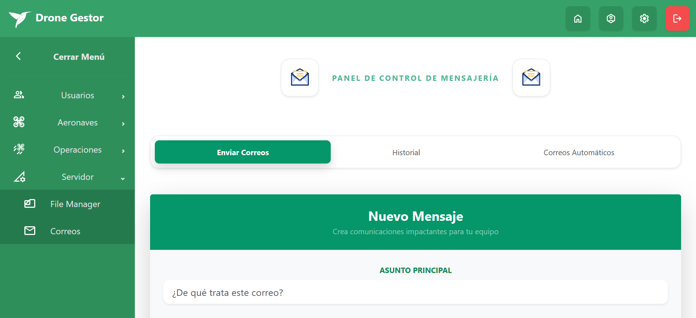 | 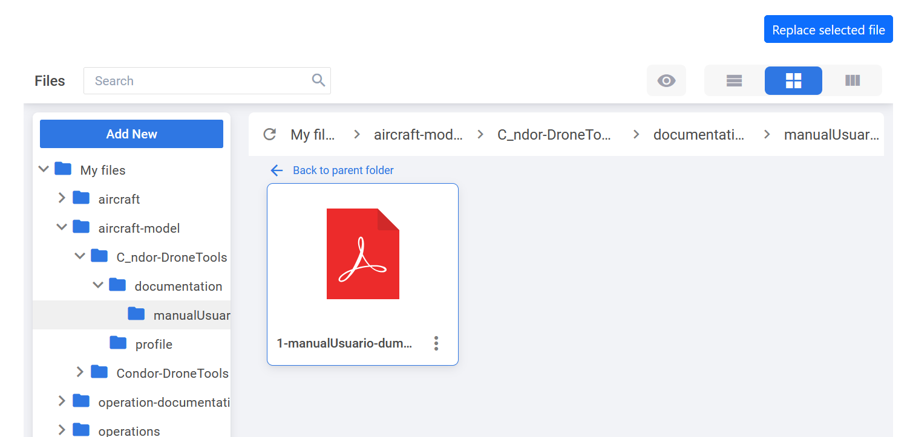 |
| *Envío de correo (se pueden seleccionar: por usuario o por rol)* | *Permite borrado y sustitución de documento* |

<b>Ver más capturas de administración en el servidor</b>

| Correos automáticos |
| :---: |
| 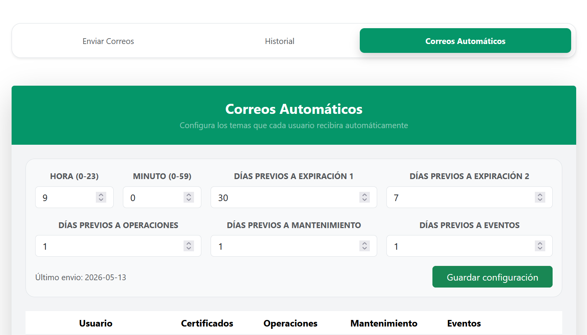 |
| *Correos automáticos al caducar certificados* |

---
[⬅️ Volver al README principal](./README.md)